<html lang="fr"><head><meta charset="UTF-8">

**Des représentations graphiques de l'évolution mondiale sont disponibles [ici](http://www.iecl.univ-lorraine.fr/~Bruno.Scherrer/git/conarvirus/).**
 **Pages similaires:**
le [site de Germain Forestier](https://germain-forestier.info/covid/), le [site de Guillaume Rozier](https://covidtracker.fr/)
## Evolution des données hospitalières en France concernant le Covid-19 <a name="top"> 

L'organisme [*Santé Publique France*](https://www.santepubliquefrance.fr/maladies-et-traumatismes/maladies-et-infections-respiratoires/infection-a-coronavirus/articles/infection-au-nouveau-coronavirus-sars-cov-2-covid-19-france-et-monde#block-242818) diffuse des [données hospitalières](https://www.data.gouv.fr/fr/datasets/donnees-hospitalieres-relatives-a-lepidemie-de-covid-19/) et des [données sur les tests virologiques](https://www.data.gouv.fr/fr/datasets/donnees-relatives-aux-resultats-des-tests-virologiques-covid-19/).

 Entre le 2020-03-18 et le 2021-12-15, on dispose 

- du nombre *quotidien* de personnes hospitalisées (dont le nombre de personnes en réanimation);
- du nombre *cumulé* des retours à domicile;
- du nombre *cumulé* des décès.

La somme de ces nombres correspond au nombre total de personnes passées par l'hôpital (et sa variation correspond chaque jour aux nouvelles admissions).

Entre le 2020-05-13 et le 2021-12-12, on dispose du nombre de tests et de cas positifs, ce qui permet d'estimer le taux d'incidence hebdomadaire (nombre de cas sur 7 jours glissants pour 100.000 habitants) ainsi que le taux de positivité.

Ces informations sont représentées dans cette page sous forme de

- **graphiques**
    - [pour la France entière](#france)
    - [par région](#par_regions)
    - [par département](#par_departements)
- **cartes**:
	- [cumul des hospitalisations](#cumul_hosp)
	- [cumul des décès](#cumul_deces)
	- [hospitalisations](#hosp)
	- [personnes en réanimations](#rea)
	- [nombre de lits de réanimation et tension](#lits)
	- [mortalité](#mortalite)
	- [taux d'incidence](#incid)
	- [taux de positivité](#posit).

*Tous les graphiques sont accessibles sous forme de fichier pdf (en cliquant sur les images). Cette page est générée automatiquement par un [script python accessible sur github](https://github.com/brunoscherrer/santepubliquefrance).* 
 
- - - -

 **<ins>Avertissement</ins>: Les graphiques de cette page ne concernent que les personnes qui ont été hospitalisées; en particulier, cela ne concerne pas celles qui sont décédées à cause du Covid-19 sans être passées par l'hôpital (en noir et grisé ci-dessous).**

 
[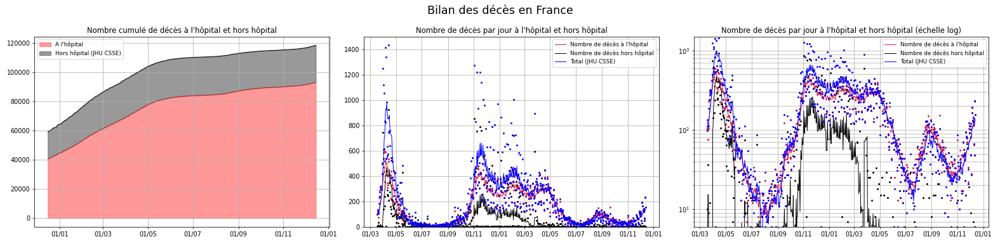](./fig/deces.pdf) 

- - - -

- - - -

### France (graphiques)<a name="france">

#### France entière<a name="france_total"> 
 

#### France, par régions (graphiques)<a name="france_regions">

 

- - - -
### Régions <a name="par_regions"> ([Retour au sommaire](#top))

- Auvergne-Rhône-Alpes : *[total](#Auvergne_Rhone_Alpes), [par département](#Auvergne_Rhone_Alpes_detail)*
- Bourgogne-Franche-Comté : *[total](#Bourgogne_Franche_Comte), [par département](#Bourgogne_Franche_Comte_detail)*
- Bretagne : *[total](#Bretagne), [par département](#Bretagne_detail)*
- Centre-Val de Loire : *[total](#Centre_Val_de_Loire), [par département](#Centre_Val_de_Loire_detail)*
- Corse : *[total](#Corse), [par département](#Corse_detail)*
- Grand Est : *[total](#Grand_Est), [par département](#Grand_Est_detail)*
- Guadeloupe : *[total](#Guadeloupe)*
- Guyane : *[total](#Guyane)*
- Hauts-de-France : *[total](#Hauts_de_France), [par département](#Hauts_de_France_detail)*
- Île-de-France : *[total](#Ile_de_France), [par département](#Ile_de_France_detail)*
- La Réunion : *[total](#La_Reunion)*
- Martinique : *[total](#Martinique)*
- Mayotte : *[total](#Mayotte)*
- Normandie : *[total](#Normandie), [par département](#Normandie_detail)*
- Nouvelle-Aquitaine : *[total](#Nouvelle_Aquitaine), [par département](#Nouvelle_Aquitaine_detail)*
- Occitanie : *[total](#Occitanie), [par département](#Occitanie_detail)*
- Pays de la Loire : *[total](#Pays_de_la_Loire), [par département](#Pays_de_la_Loire_detail)*
- Provence-Alpes-Côte d'Azur : *[total](#Provence_Alpes_Cote_d_Azur), [par département](#Provence_Alpes_Cote_d_Azur_detail)*

 - - - -

<a name="Auvergne_Rhone_Alpes"> 
[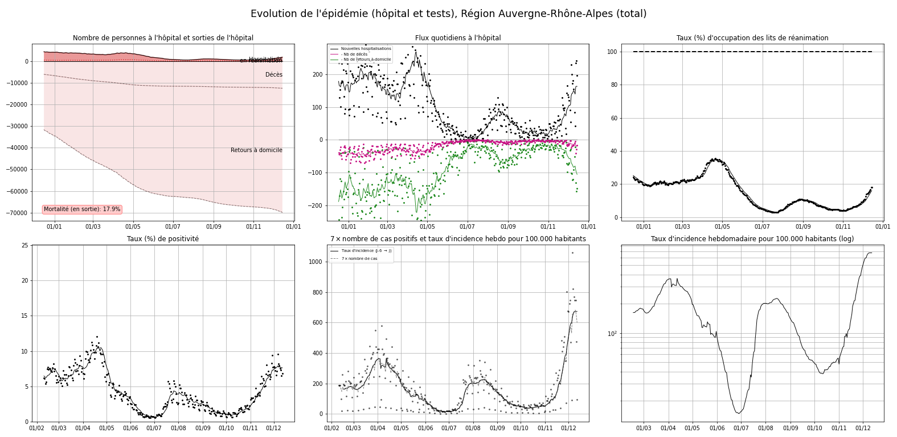](./fig/Auvergne_Rhone_Alpes_total.pdf)  

[Retour au sommaire](#top)

<a name="Auvergne_Rhone_Alpes_detail">
  

 Par département de la région Auvergne-Rhône-Alpes

- [01: Ain](#01)
- [03: Allier](#03)
- [07: Ardèche](#07)
- [15: Cantal](#15)
- [26: Drôme](#26)
- [38: Isère](#38)
- [42: Loire](#42)
- [43: Haute-Loire](#43)
- [63: Puy-de-Dôme](#63)
- [69: Rhône](#69)
- [73: Savoie](#73)
- [74: Haute-Savoie](#74)

[Retour au sommaire](#top)

 - - - -

<a name="Bourgogne_Franche_Comte"> 
  

[Retour au sommaire](#top)

<a name="Bourgogne_Franche_Comte_detail">
  

 Par département de la région Bourgogne-Franche-Comté

- [21: Côte-d'Or](#21)
- [25: Doubs](#25)
- [39: Jura](#39)
- [58: Nièvre](#58)
- [70: Haute-Saône](#70)
- [71: Saône-et-Loire](#71)
- [89: Yonne](#89)
- [90: Territoire de Belfort](#90)

[Retour au sommaire](#top)

 - - - -

<a name="Bretagne"> 
  

[Retour au sommaire](#top)

<a name="Bretagne_detail">
[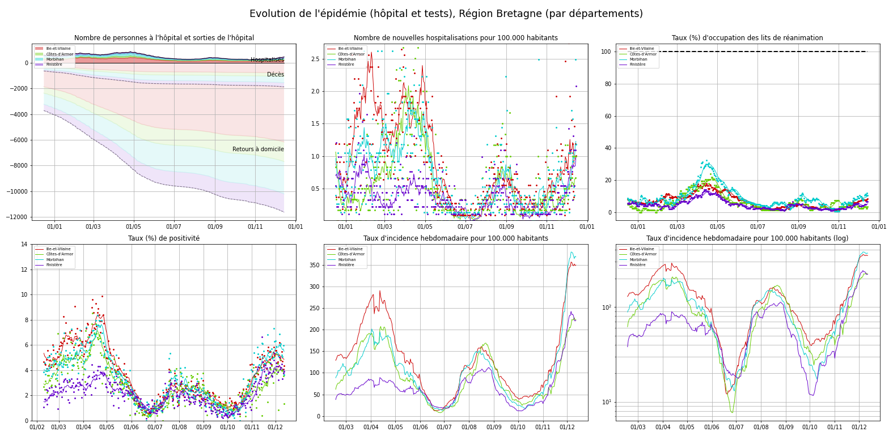](./fig/Bretagne.pdf)  

 Par département de la région Bretagne

- [35: Ille-et-Vilaine](#35)
- [22: Côtes-d'Armor](#22)
- [56: Morbihan](#56)
- [29: Finistère](#29)

[Retour au sommaire](#top)

 - - - -

<a name="Centre_Val_de_Loire"> 
  

[Retour au sommaire](#top)

<a name="Centre_Val_de_Loire_detail">
  

 Par département de la région Centre-Val de Loire

- [18: Cher](#18)
- [28: Eure-et-Loir](#28)
- [36: Indre](#36)
- [37: Indre-et-Loire](#37)
- [41: Loir-et-Cher](#41)
- [45: Loiret](#45)

[Retour au sommaire](#top)

 - - - -

<a name="Corse"> 
[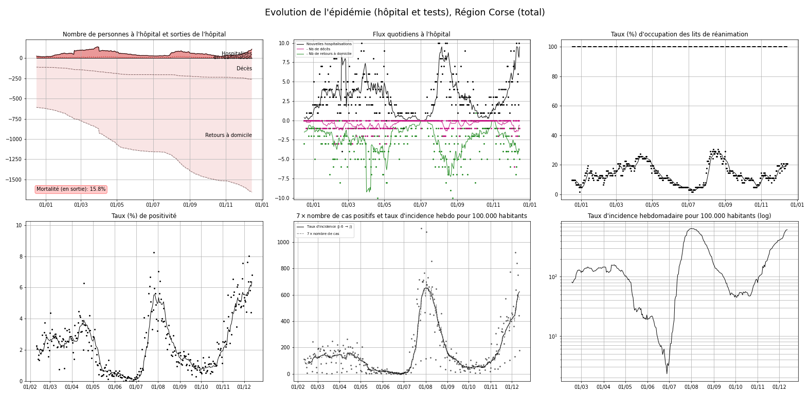](./fig/Corse_total.pdf)  

[Retour au sommaire](#top)

<a name="Corse_detail">
[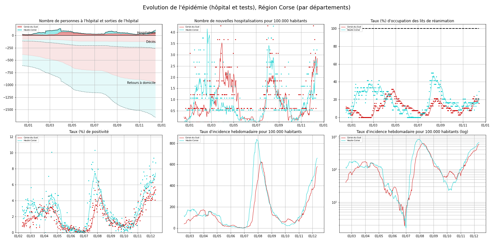](./fig/Corse.pdf)  

 Par département de la région Corse

- [2A: Corse-du-Sud](#2A)
- [2B: Haute-Corse](#2B)

[Retour au sommaire](#top)

 - - - -

<a name="Grand_Est"> 
  

[Retour au sommaire](#top)

<a name="Grand_Est_detail">
[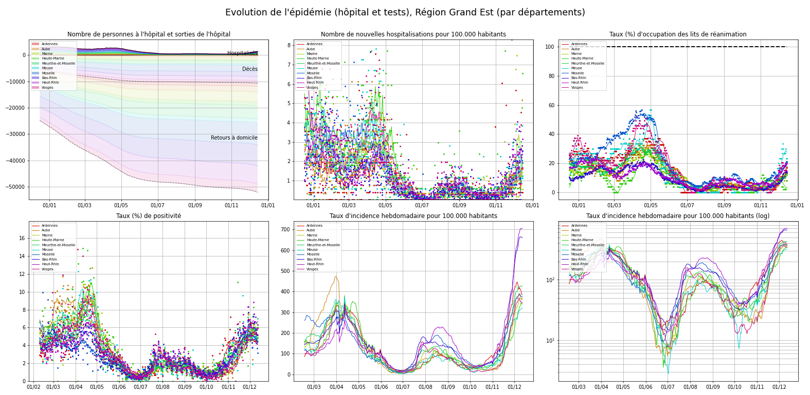](./fig/Grand_Est.pdf)  

 Par département de la région Grand Est

- [08: Ardennes](#08)
- [10: Aube](#10)
- [51: Marne](#51)
- [52: Haute-Marne](#52)
- [54: Meurthe-et-Moselle](#54)
- [55: Meuse](#55)
- [57: Moselle](#57)
- [67: Bas-Rhin](#67)
- [68: Haut-Rhin](#68)
- [88: Vosges](#88)

[Retour au sommaire](#top)

 - - - -

<a name="Guadeloupe"> 
  

[Retour au sommaire](#top)

 - - - -

<a name="Guyane"> 
[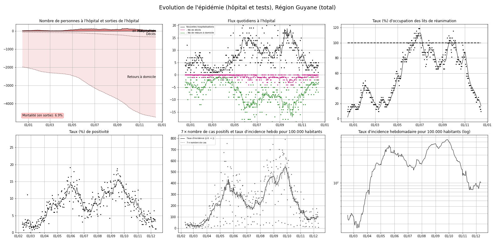](./fig/Guyane_total.pdf)  

[Retour au sommaire](#top)

 - - - -

<a name="Hauts_de_France"> 
  

[Retour au sommaire](#top)

<a name="Hauts_de_France_detail">
[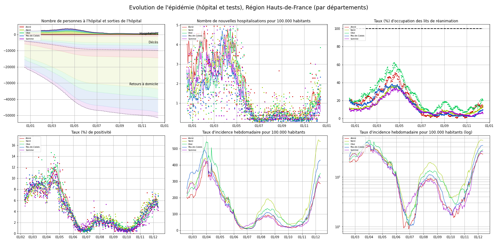](./fig/Hauts_de_France.pdf)  

 Par département de la région Hauts-de-France

- [02: Aisne](#02)
- [59: Nord](#59)
- [60: Oise](#60)
- [62: Pas-de-Calais](#62)
- [80: Somme](#80)

[Retour au sommaire](#top)

 - - - -

<a name="Ile_de_France"> 
[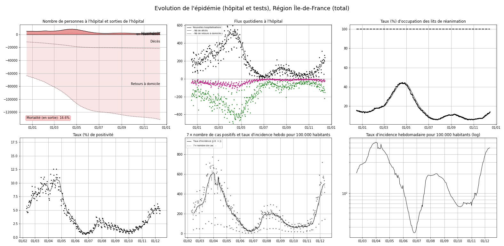](./fig/Ile_de_France_total.pdf)  

[Retour au sommaire](#top)

<a name="Ile_de_France_detail">
[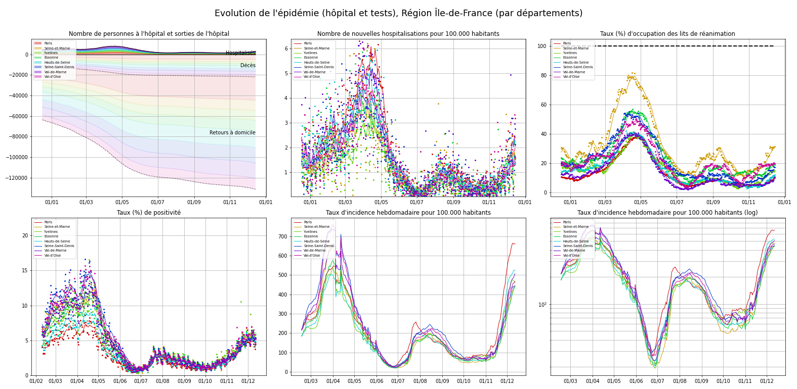](./fig/Ile_de_France.pdf)  

 Par département de la région Île-de-France

- [75: Paris](#75)
- [77: Seine-et-Marne](#77)
- [78: Yvelines](#78)
- [91: Essonne](#91)
- [92: Hauts-de-Seine](#92)
- [93: Seine-Saint-Denis](#93)
- [94: Val-de-Marne](#94)
- [95: Val-d'Oise](#95)

[Retour au sommaire](#top)

 - - - -

<a name="La_Reunion"> 
[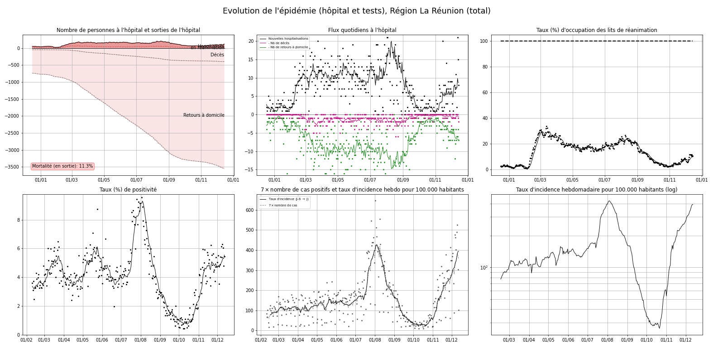](./fig/La_Reunion_total.pdf)  

[Retour au sommaire](#top)

 - - - -

<a name="Martinique"> 
  

[Retour au sommaire](#top)

 - - - -

<a name="Mayotte"> 
  

[Retour au sommaire](#top)

 - - - -

<a name="Normandie"> 
[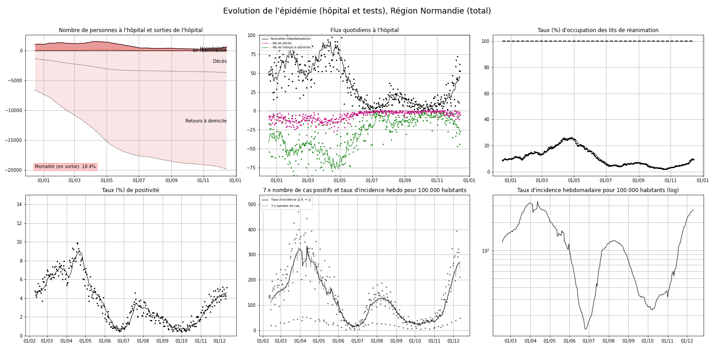](./fig/Normandie_total.pdf)  

[Retour au sommaire](#top)

<a name="Normandie_detail">
[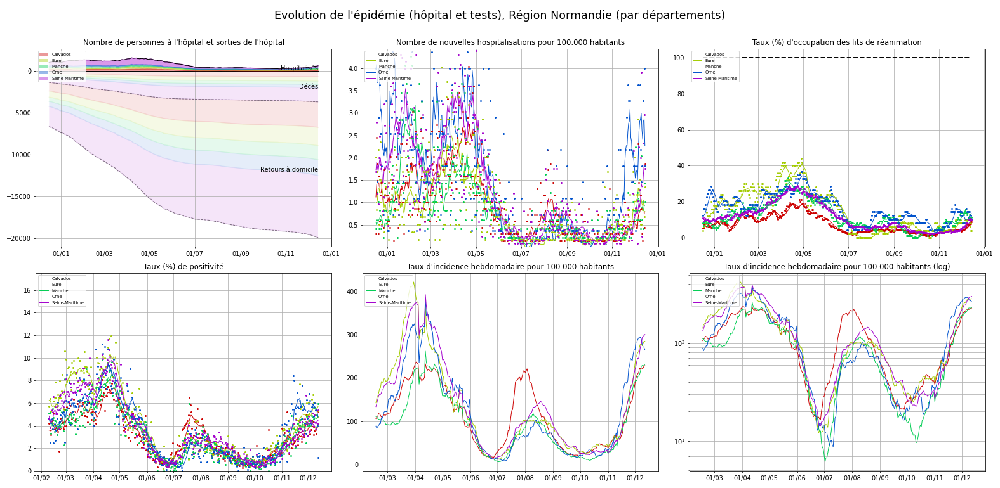](./fig/Normandie.pdf)  

 Par département de la région Normandie

- [14: Calvados](#14)
- [27: Eure](#27)
- [50: Manche](#50)
- [61: Orne](#61)
- [76: Seine-Maritime](#76)

[Retour au sommaire](#top)

 - - - -

<a name="Nouvelle_Aquitaine"> 
[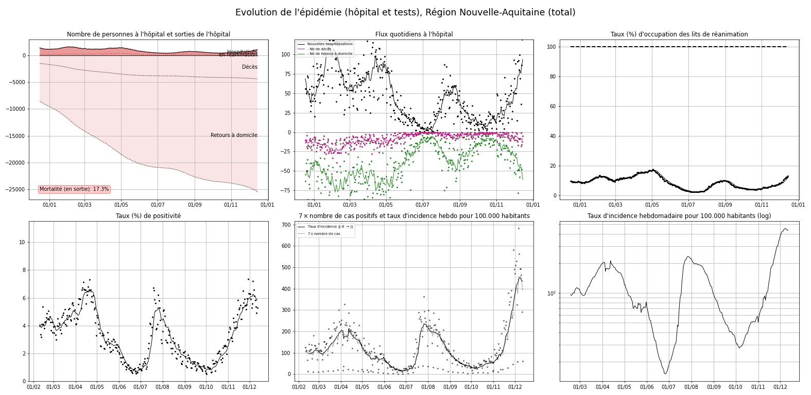](./fig/Nouvelle_Aquitaine_total.pdf)  

[Retour au sommaire](#top)

<a name="Nouvelle_Aquitaine_detail">
  

 Par département de la région Nouvelle-Aquitaine

- [16: Charente](#16)
- [17: Charente-Maritime](#17)
- [19: Corrèze](#19)
- [23: Creuse](#23)
- [24: Dordogne](#24)
- [33: Gironde](#33)
- [40: Landes](#40)
- [47: Lot-et-Garonne](#47)
- [64: Pyrénées-Atlantiques](#64)
- [79: Deux-Sèvres](#79)
- [86: Vienne](#86)
- [87: Haute-Vienne](#87)

[Retour au sommaire](#top)

 - - - -

<a name="Occitanie"> 
  

[Retour au sommaire](#top)

<a name="Occitanie_detail">
[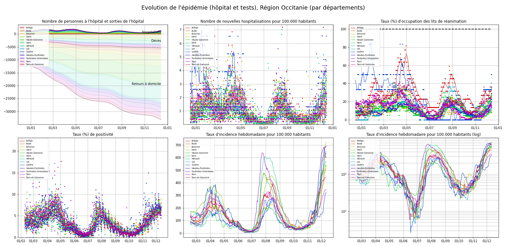](./fig/Occitanie.pdf)  

 Par département de la région Occitanie

- [09: Ariège](#09)
- [11: Aude](#11)
- [12: Aveyron](#12)
- [30: Gard](#30)
- [31: Haute-Garonne](#31)
- [32: Gers](#32)
- [34: Hérault](#34)
- [46: Lot](#46)
- [48: Lozère](#48)
- [65: Hautes-Pyrénées](#65)
- [66: Pyrénées-Orientales](#66)
- [81: Tarn](#81)
- [82: Tarn-et-Garonne](#82)

[Retour au sommaire](#top)

 - - - -

<a name="Pays_de_la_Loire"> 
[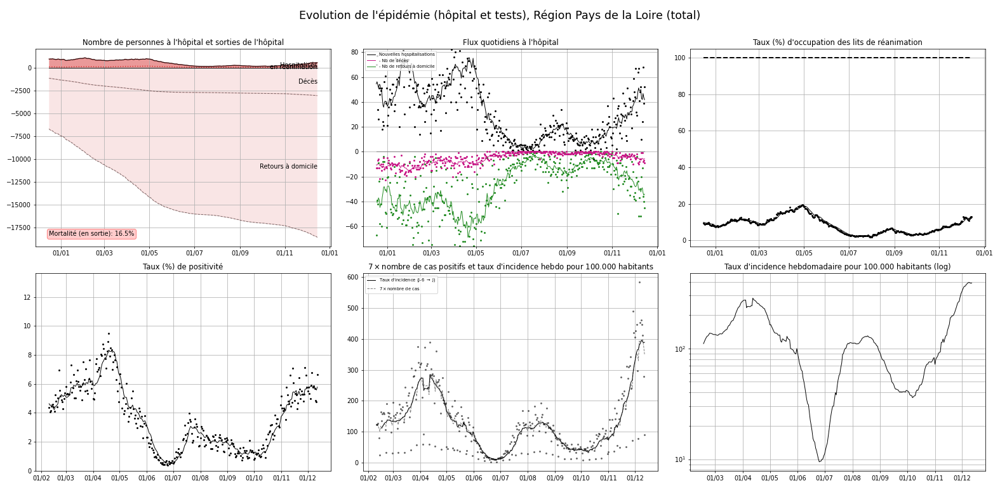](./fig/Pays_de_la_Loire_total.pdf)  

[Retour au sommaire](#top)

<a name="Pays_de_la_Loire_detail">
[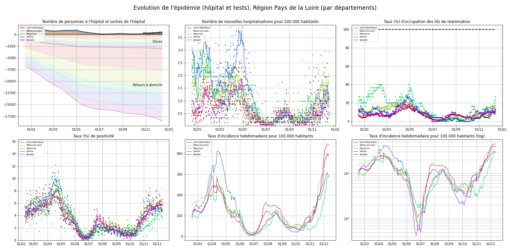](./fig/Pays_de_la_Loire.pdf)  

 Par département de la région Pays de la Loire

- [44: Loire-Atlantique](#44)
- [49: Maine-et-Loire](#49)
- [53: Mayenne](#53)
- [72: Sarthe](#72)
- [85: Vendée](#85)

[Retour au sommaire](#top)

 - - - -

<a name="Provence_Alpes_Cote_d_Azur"> 
[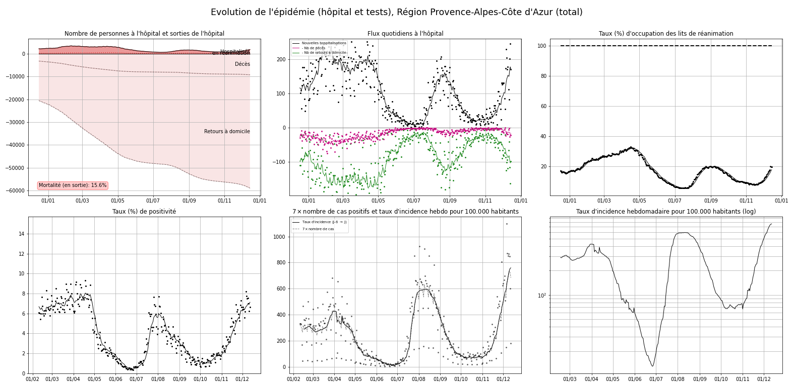](./fig/Provence_Alpes_Cote_d_Azur_total.pdf)  

[Retour au sommaire](#top)

<a name="Provence_Alpes_Cote_d_Azur_detail">
[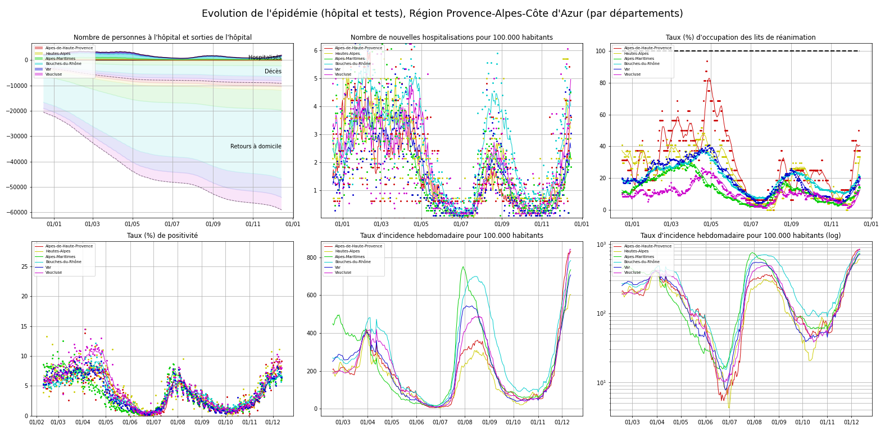](./fig/Provence_Alpes_Cote_d_Azur.pdf)  

 Par département de la région Provence-Alpes-Côte d'Azur

- [04: Alpes-de-Haute-Provence](#04)
- [05: Hautes-Alpes](#05)
- [06: Alpes-Maritimes](#06)
- [13: Bouches-du-Rhône](#13)
- [83: Var](#83)
- [84: Vaucluse](#84)

[Retour au sommaire](#top)

- - - -

### Départements  <a name="par_departements"> ([Retour au sommaire](#top))

- [01: Ain](#01)
- [02: Aisne](#02)
- [03: Allier](#03)
- [04: Alpes-de-Haute-Provence](#04)
- [05: Hautes-Alpes](#05)
- [06: Alpes-Maritimes](#06)
- [07: Ardèche](#07)
- [08: Ardennes](#08)
- [09: Ariège](#09)
- [10: Aube](#10)
- [11: Aude](#11)
- [12: Aveyron](#12)
- [13: Bouches-du-Rhône](#13)
- [14: Calvados](#14)
- [15: Cantal](#15)
- [16: Charente](#16)
- [17: Charente-Maritime](#17)
- [18: Cher](#18)
- [19: Corrèze](#19)
- [21: Côte-d'Or](#21)
- [22: Côtes-d'Armor](#22)
- [23: Creuse](#23)
- [24: Dordogne](#24)
- [25: Doubs](#25)
- [26: Drôme](#26)
- [27: Eure](#27)
- [28: Eure-et-Loir](#28)
- [29: Finistère](#29)
- [2A: Corse-du-Sud](#2A)
- [2B: Haute-Corse](#2B)
- [30: Gard](#30)
- [31: Haute-Garonne](#31)
- [32: Gers](#32)
- [33: Gironde](#33)
- [34: Hérault](#34)
- [35: Ille-et-Vilaine](#35)
- [36: Indre](#36)
- [37: Indre-et-Loire](#37)
- [38: Isère](#38)
- [39: Jura](#39)
- [40: Landes](#40)
- [41: Loir-et-Cher](#41)
- [42: Loire](#42)
- [43: Haute-Loire](#43)
- [44: Loire-Atlantique](#44)
- [45: Loiret](#45)
- [46: Lot](#46)
- [47: Lot-et-Garonne](#47)
- [48: Lozère](#48)
- [49: Maine-et-Loire](#49)
- [50: Manche](#50)
- [51: Marne](#51)
- [52: Haute-Marne](#52)
- [53: Mayenne](#53)
- [54: Meurthe-et-Moselle](#54)
- [55: Meuse](#55)
- [56: Morbihan](#56)
- [57: Moselle](#57)
- [58: Nièvre](#58)
- [59: Nord](#59)
- [60: Oise](#60)
- [61: Orne](#61)
- [62: Pas-de-Calais](#62)
- [63: Puy-de-Dôme](#63)
- [64: Pyrénées-Atlantiques](#64)
- [65: Hautes-Pyrénées](#65)
- [66: Pyrénées-Orientales](#66)
- [67: Bas-Rhin](#67)
- [68: Haut-Rhin](#68)
- [69: Rhône](#69)
- [70: Haute-Saône](#70)
- [71: Saône-et-Loire](#71)
- [72: Sarthe](#72)
- [73: Savoie](#73)
- [74: Haute-Savoie](#74)
- [75: Paris](#75)
- [76: Seine-Maritime](#76)
- [77: Seine-et-Marne](#77)
- [78: Yvelines](#78)
- [79: Deux-Sèvres](#79)
- [80: Somme](#80)
- [81: Tarn](#81)
- [82: Tarn-et-Garonne](#82)
- [83: Var](#83)
- [84: Vaucluse](#84)
- [85: Vendée](#85)
- [86: Vienne](#86)
- [87: Haute-Vienne](#87)
- [88: Vosges](#88)
- [89: Yonne](#89)
- [90: Territoire de Belfort](#90)
- [91: Essonne](#91)
- [92: Hauts-de-Seine](#92)
- [93: Seine-Saint-Denis](#93)
- [94: Val-de-Marne](#94)
- [95: Val-d'Oise](#95)
- [971: Guadeloupe](#971)
- [972: Martinique](#972)
- [973: Guyane](#973)
- [974: La Réunion](#974)
- [976: Mayotte](#976)

 - - - -
<a name="01"> [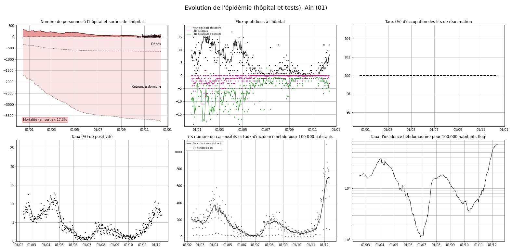](./fig/01_total.pdf)  
 [Retour au sommaire](#top)

 - - - -
<a name="02"> [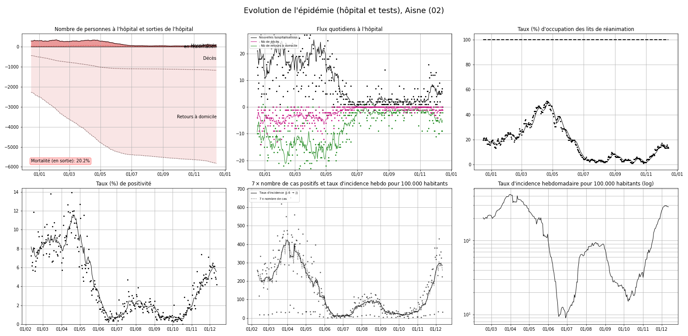](./fig/02_total.pdf)  
 [Retour au sommaire](#top)

 - - - -
<a name="03"> [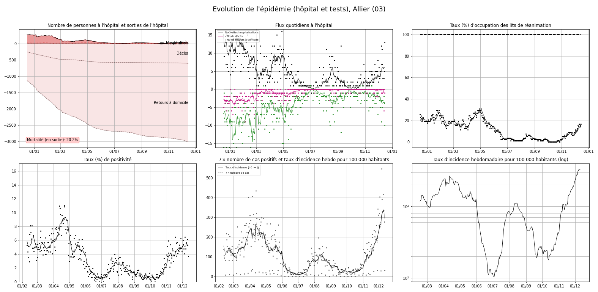](./fig/03_total.pdf)  
 [Retour au sommaire](#top)

 - - - -
<a name="04">   
 [Retour au sommaire](#top)

 - - - -
<a name="05">   
 [Retour au sommaire](#top)

 - - - -
<a name="06">   
 [Retour au sommaire](#top)

 - - - -
<a name="07"> [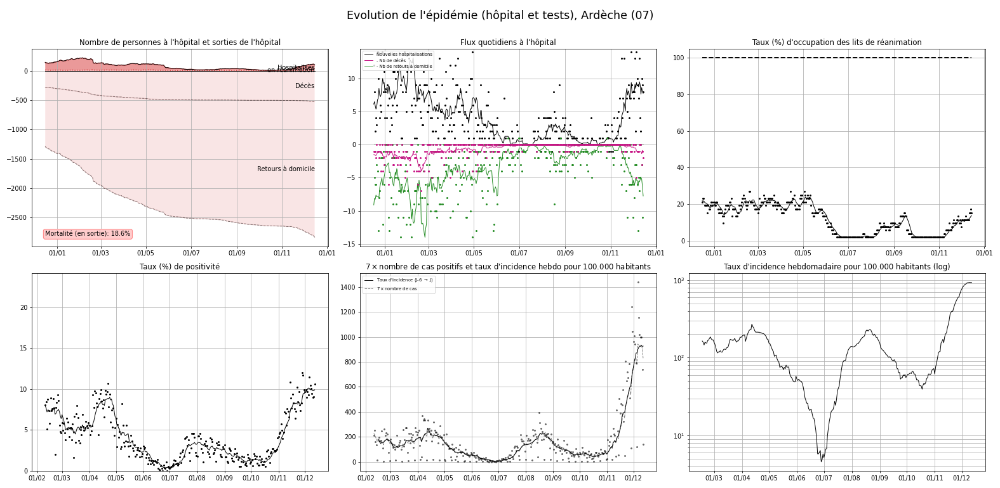](./fig/07_total.pdf)  
 [Retour au sommaire](#top)

 - - - -
<a name="08">   
 [Retour au sommaire](#top)

 - - - -
<a name="09"> [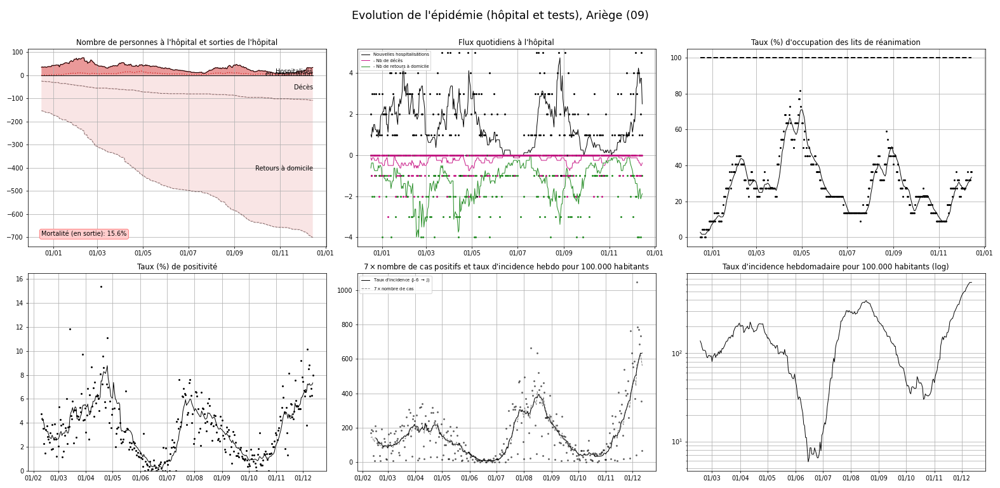](./fig/09_total.pdf)  
 [Retour au sommaire](#top)

 - - - -
<a name="10">   
 [Retour au sommaire](#top)

 - - - -
<a name="11"> [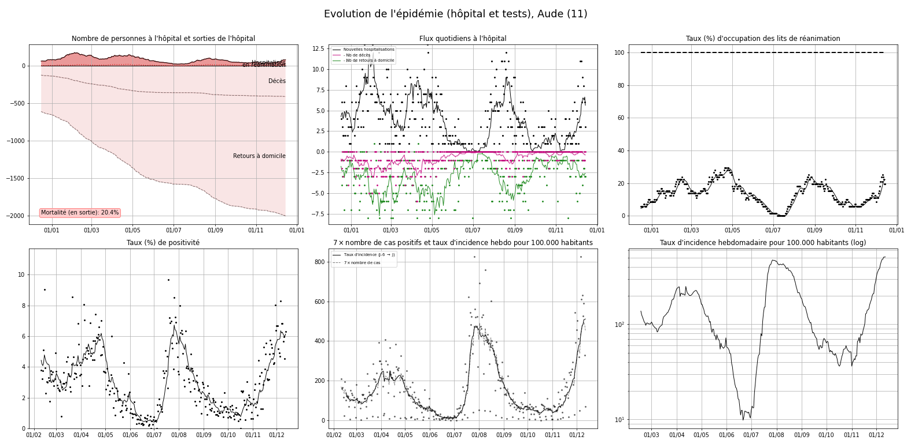](./fig/11_total.pdf)  
 [Retour au sommaire](#top)

 - - - -
<a name="12">   
 [Retour au sommaire](#top)

 - - - -
<a name="13"> [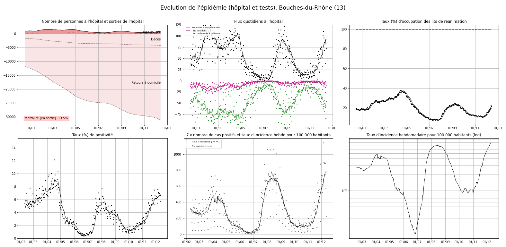](./fig/13_total.pdf)  
 [Retour au sommaire](#top)

 - - - -
<a name="14"> [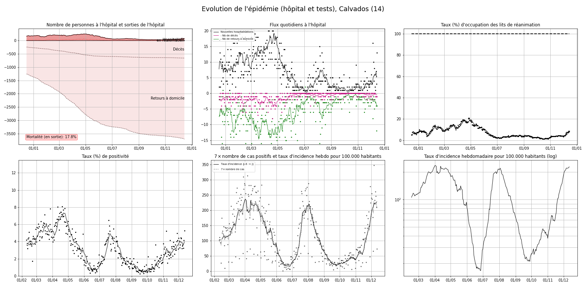](./fig/14_total.pdf)  
 [Retour au sommaire](#top)

 - - - -
<a name="15"> [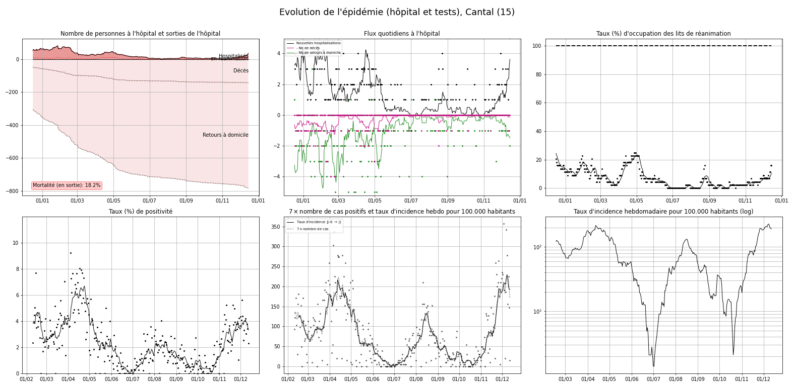](./fig/15_total.pdf)  
 [Retour au sommaire](#top)

 - - - -
<a name="16">   
 [Retour au sommaire](#top)

 - - - -
<a name="17">   
 [Retour au sommaire](#top)

 - - - -
<a name="18">   
 [Retour au sommaire](#top)

 - - - -
<a name="19">   
 [Retour au sommaire](#top)

 - - - -
<a name="21"> [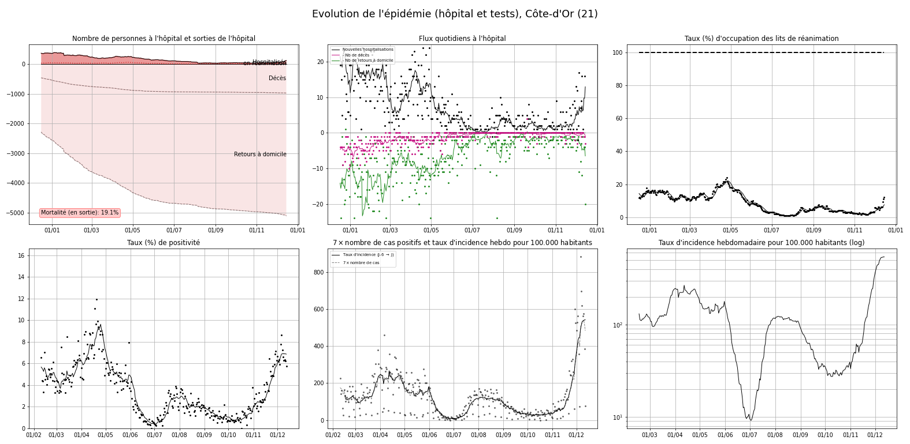](./fig/21_total.pdf)  
 [Retour au sommaire](#top)

 - - - -
<a name="22"> [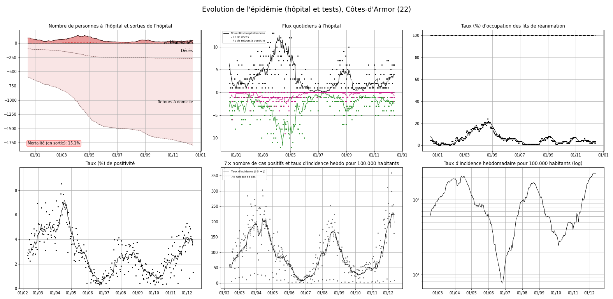](./fig/22_total.pdf)  
 [Retour au sommaire](#top)

 - - - -
<a name="23"> [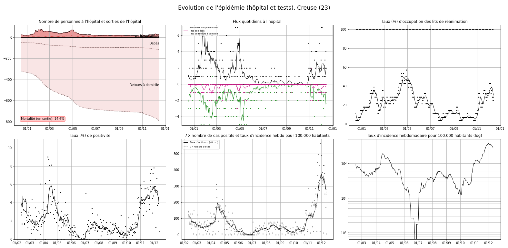](./fig/23_total.pdf)  
 [Retour au sommaire](#top)

 - - - -
<a name="24">   
 [Retour au sommaire](#top)

 - - - -
<a name="25"> [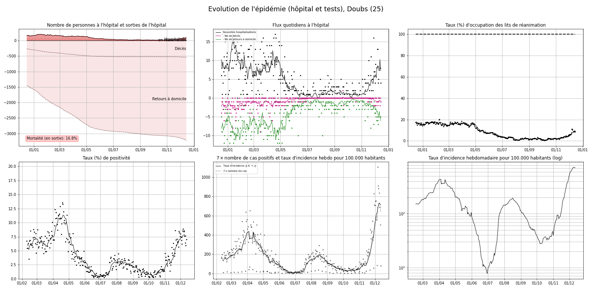](./fig/25_total.pdf)  
 [Retour au sommaire](#top)

 - - - -
<a name="26">   
 [Retour au sommaire](#top)

 - - - -
<a name="27">   
 [Retour au sommaire](#top)

 - - - -
<a name="28">   
 [Retour au sommaire](#top)

 - - - -
<a name="29">   
 [Retour au sommaire](#top)

 - - - -
<a name="2A"> [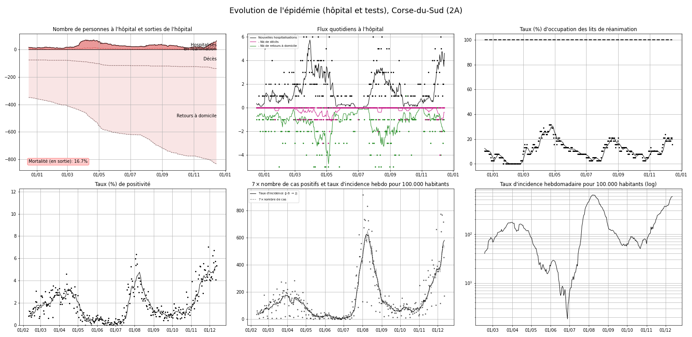](./fig/2A_total.pdf)  
 [Retour au sommaire](#top)

 - - - -
<a name="2B"> [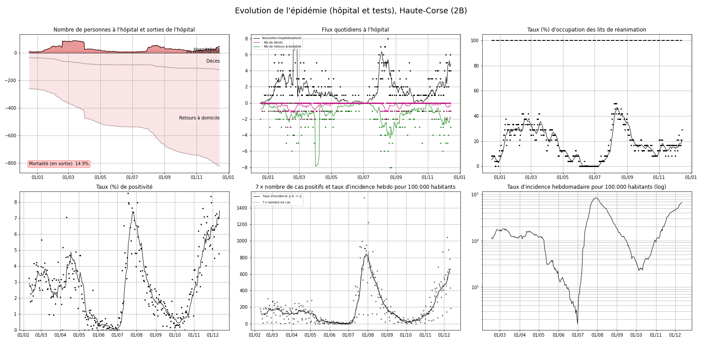](./fig/2B_total.pdf)  
 [Retour au sommaire](#top)

 - - - -
<a name="30">   
 [Retour au sommaire](#top)

 - - - -
<a name="31">   
 [Retour au sommaire](#top)

 - - - -
<a name="32"> [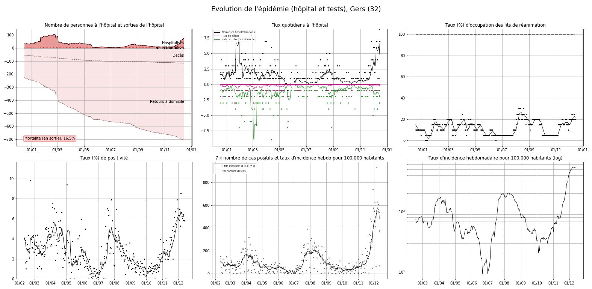](./fig/32_total.pdf)  
 [Retour au sommaire](#top)

 - - - -
<a name="33">   
 [Retour au sommaire](#top)

 - - - -
<a name="34">   
 [Retour au sommaire](#top)

 - - - -
<a name="35">   
 [Retour au sommaire](#top)

 - - - -
<a name="36">   
 [Retour au sommaire](#top)

 - - - -
<a name="37">   
 [Retour au sommaire](#top)

 - - - -
<a name="38"> [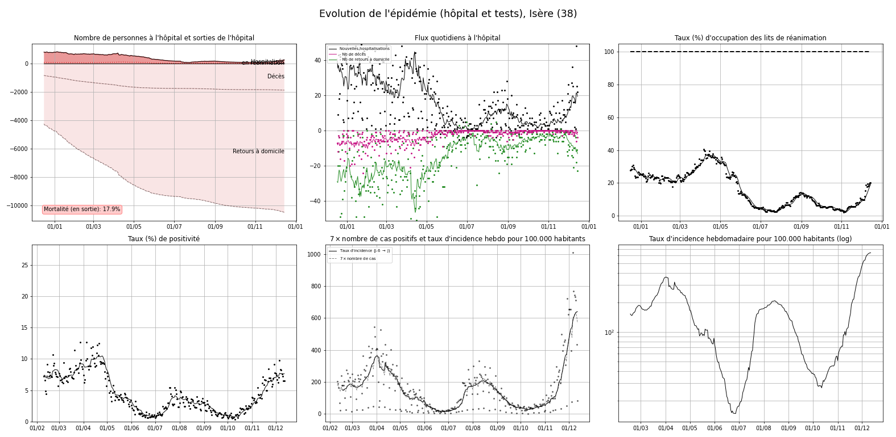](./fig/38_total.pdf)  
 [Retour au sommaire](#top)

 - - - -
<a name="39">   
 [Retour au sommaire](#top)

 - - - -
<a name="40"> [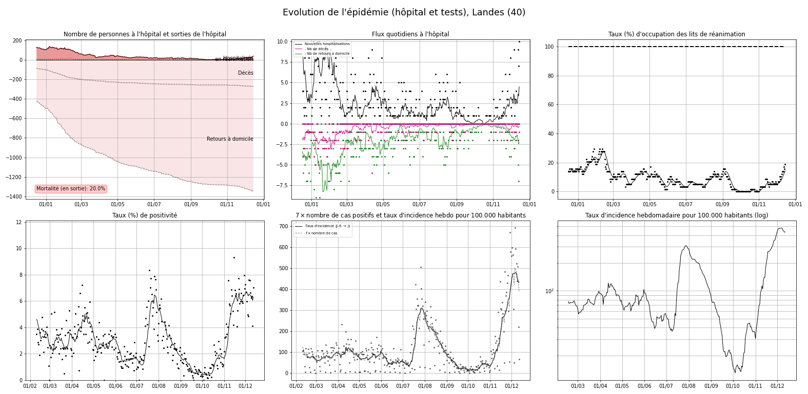](./fig/40_total.pdf)  
 [Retour au sommaire](#top)

 - - - -
<a name="41"> [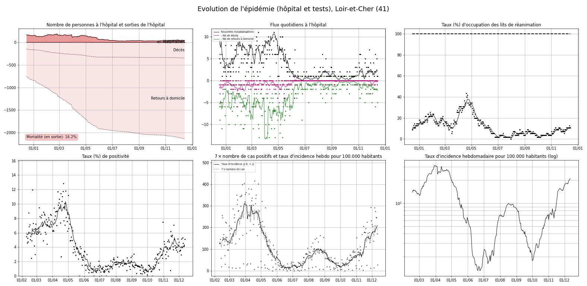](./fig/41_total.pdf)  
 [Retour au sommaire](#top)

 - - - -
<a name="42"> [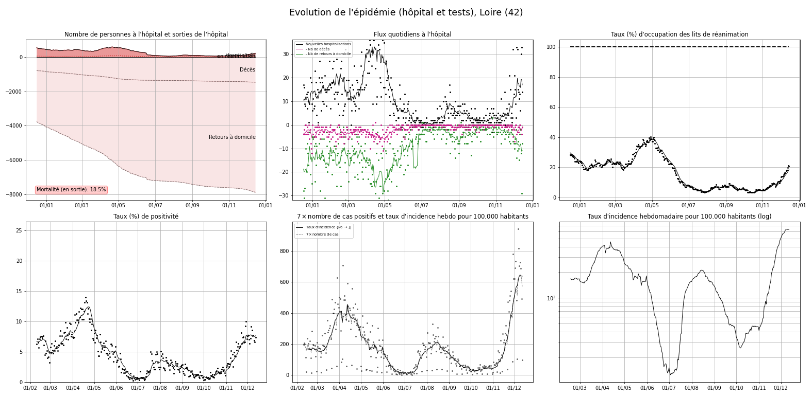](./fig/42_total.pdf)  
 [Retour au sommaire](#top)

 - - - -
<a name="43"> [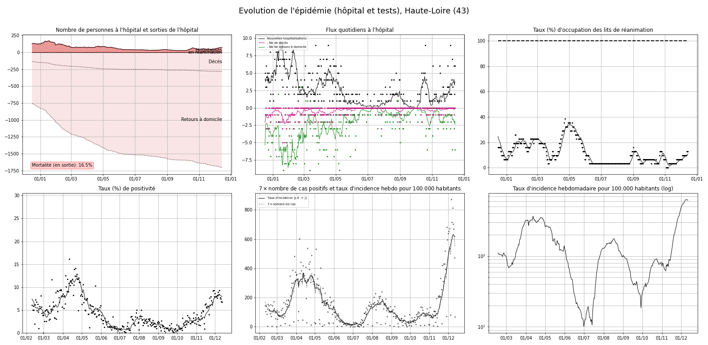](./fig/43_total.pdf)  
 [Retour au sommaire](#top)

 - - - -
<a name="44">   
 [Retour au sommaire](#top)

 - - - -
<a name="45"> [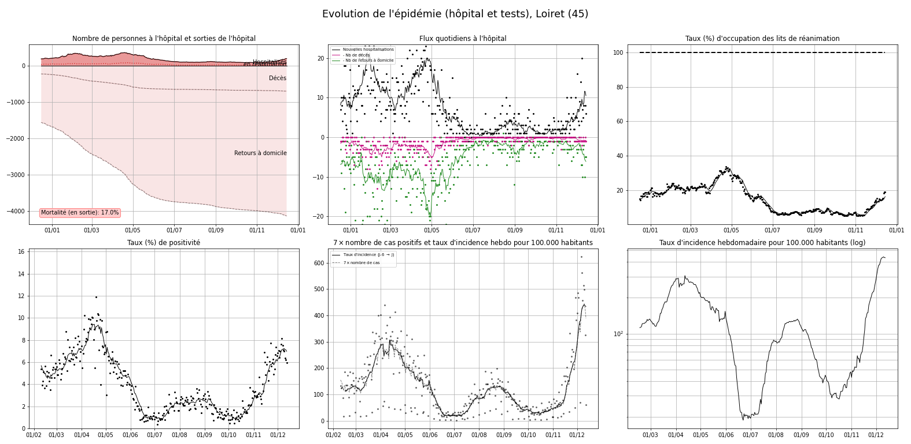](./fig/45_total.pdf)  
 [Retour au sommaire](#top)

 - - - -
<a name="46">   
 [Retour au sommaire](#top)

 - - - -
<a name="47"> [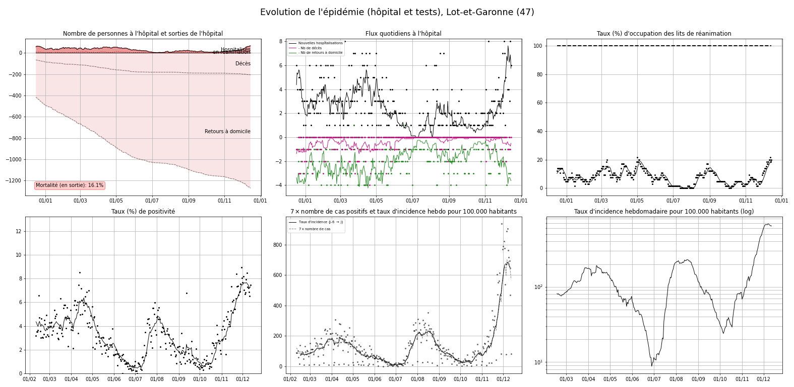](./fig/47_total.pdf)  
 [Retour au sommaire](#top)

 - - - -
<a name="48">   
 [Retour au sommaire](#top)

 - - - -
<a name="49"> [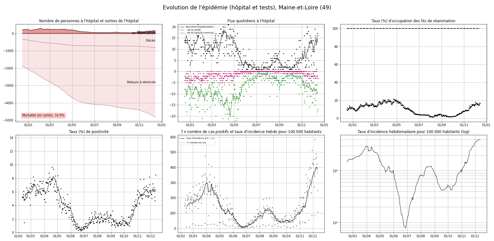](./fig/49_total.pdf)  
 [Retour au sommaire](#top)

 - - - -
<a name="50">   
 [Retour au sommaire](#top)

 - - - -
<a name="51">   
 [Retour au sommaire](#top)

 - - - -
<a name="52"> [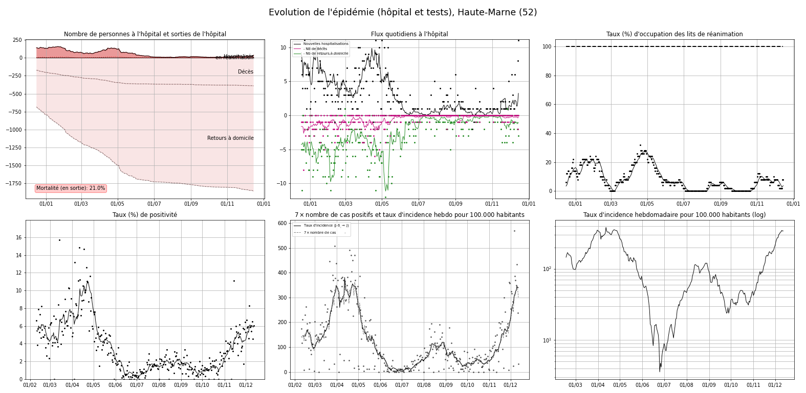](./fig/52_total.pdf)  
 [Retour au sommaire](#top)

 - - - -
<a name="53"> [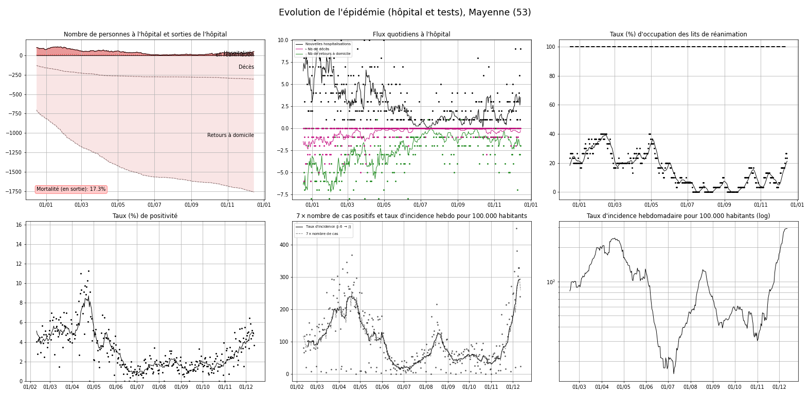](./fig/53_total.pdf)  
 [Retour au sommaire](#top)

 - - - -
<a name="54">   
 [Retour au sommaire](#top)

 - - - -
<a name="55"> [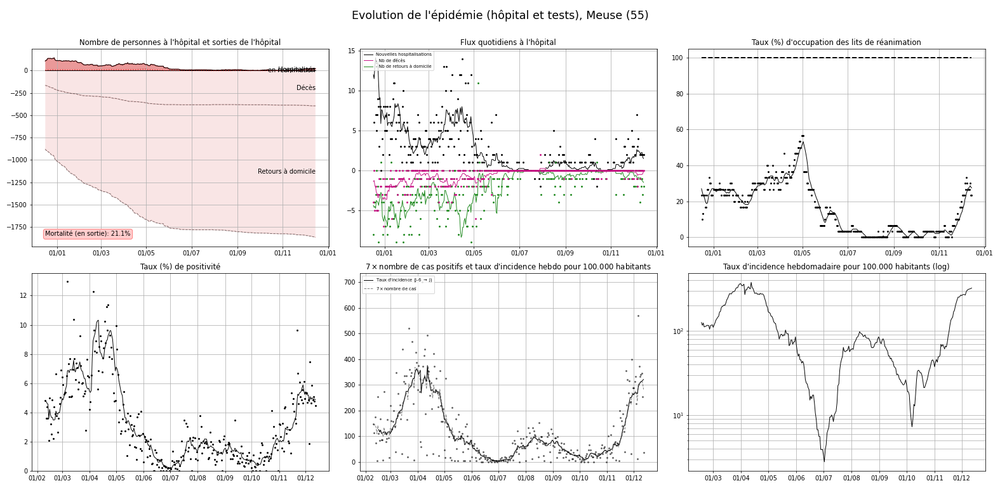](./fig/55_total.pdf)  
 [Retour au sommaire](#top)

 - - - -
<a name="56"> [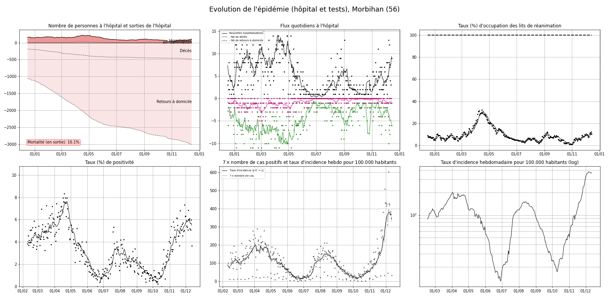](./fig/56_total.pdf)  
 [Retour au sommaire](#top)

 - - - -
<a name="57">   
 [Retour au sommaire](#top)

 - - - -
<a name="58">   
 [Retour au sommaire](#top)

 - - - -
<a name="59">   
 [Retour au sommaire](#top)

 - - - -
<a name="60">   
 [Retour au sommaire](#top)

 - - - -
<a name="61"> [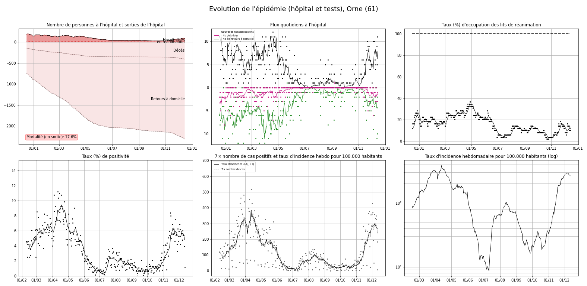](./fig/61_total.pdf)  
 [Retour au sommaire](#top)

 - - - -
<a name="62">   
 [Retour au sommaire](#top)

 - - - -
<a name="63"> [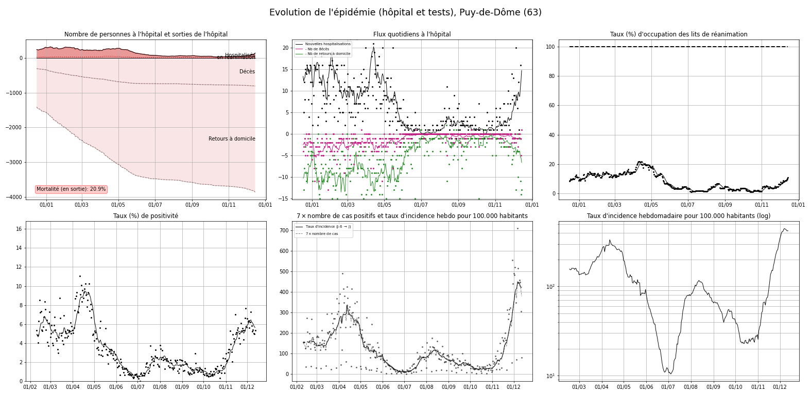](./fig/63_total.pdf)  
 [Retour au sommaire](#top)

 - - - -
<a name="64">   
 [Retour au sommaire](#top)

 - - - -
<a name="65">   
 [Retour au sommaire](#top)

 - - - -
<a name="66">   
 [Retour au sommaire](#top)

 - - - -
<a name="67"> [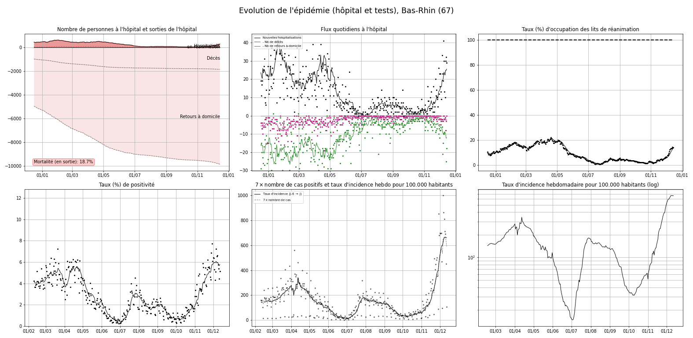](./fig/67_total.pdf)  
 [Retour au sommaire](#top)

 - - - -
<a name="68"> [](./fig/68_total.pdf)  
 [Retour au sommaire](#top)

 - - - -
<a name="69">   
 [Retour au sommaire](#top)

 - - - -
<a name="70">   
 [Retour au sommaire](#top)

 - - - -
<a name="71"> [](./fig/71_total.pdf)  
 [Retour au sommaire](#top)

 - - - -
<a name="72"> [](./fig/72_total.pdf)  
 [Retour au sommaire](#top)

 - - - -
<a name="73"> [](./fig/73_total.pdf)  
 [Retour au sommaire](#top)

 - - - -
<a name="74">   
 [Retour au sommaire](#top)

 - - - -
<a name="75"> [](./fig/75_total.pdf)  
 [Retour au sommaire](#top)

 - - - -
<a name="76">   
 [Retour au sommaire](#top)

 - - - -
<a name="77"> [](./fig/77_total.pdf)  
 [Retour au sommaire](#top)

 - - - -
<a name="78">   
 [Retour au sommaire](#top)

 - - - -
<a name="79">   
 [Retour au sommaire](#top)

 - - - -
<a name="80"> [](./fig/80_total.pdf)  
 [Retour au sommaire](#top)

 - - - -
<a name="81">   
 [Retour au sommaire](#top)

 - - - -
<a name="82">   
 [Retour au sommaire](#top)

 - - - -
<a name="83">   
 [Retour au sommaire](#top)

 - - - -
<a name="84"> [](./fig/84_total.pdf)  
 [Retour au sommaire](#top)

 - - - -
<a name="85"> [](./fig/85_total.pdf)  
 [Retour au sommaire](#top)

 - - - -
<a name="86"> [](./fig/86_total.pdf)  
 [Retour au sommaire](#top)

 - - - -
<a name="87">   
 [Retour au sommaire](#top)

 - - - -
<a name="88"> [](./fig/88_total.pdf)  
 [Retour au sommaire](#top)

 - - - -
<a name="89">   
 [Retour au sommaire](#top)

 - - - -
<a name="90">   
 [Retour au sommaire](#top)

 - - - -
<a name="91">   
 [Retour au sommaire](#top)

 - - - -
<a name="92"> [](./fig/92_total.pdf)  
 [Retour au sommaire](#top)

 - - - -
<a name="93">   
 [Retour au sommaire](#top)

 - - - -
<a name="94">   
 [Retour au sommaire](#top)

 - - - -
<a name="95">   
 [Retour au sommaire](#top)

 - - - -
<a name="971">   
 [Retour au sommaire](#top)

 - - - -
<a name="972"> [](./fig/972_total.pdf)  
 [Retour au sommaire](#top)

 - - - -
<a name="973">   
 [Retour au sommaire](#top)

 - - - -
<a name="974"> [](./fig/974_total.pdf)  
 [Retour au sommaire](#top)

 - - - -
<a name="976"> [](./fig/976_total.pdf)  
 [Retour au sommaire](#top)

- - - -

- - - -

### France par départements (cartes)<a name="france_cartes">

 - - - -
#### Hospitalisations, patients en réanimation et décès à l'hôpital
<a name="cumul_hosp"> 
<a name="cumul_deces"> 
<a name="hosp"> 
<a name="rea"> 

 - - - -
#### Nombre de lits de réanimation (source [DREES 2018](https://drees.solidarites-sante.gouv.fr/etudes-et-statistiques/publications/article/nombre-de-lits-de-reanimation-de-soins-intensifs-et-de-soins-continus-en-france)) et tension en réanimation<a name="lits">
 

 - - - -
#### Mortalité en sortie de l'hôpital<a name="mortalite">
[](./fig/carte_mortalite.pdf)
- - - -

#### Taux d'incidence par départements (nombre de cas sur 7 jours glissants pour 100.000 habitants)<a name="incid">
 
#### Taux de positivité <a name="posit">
 
</html>